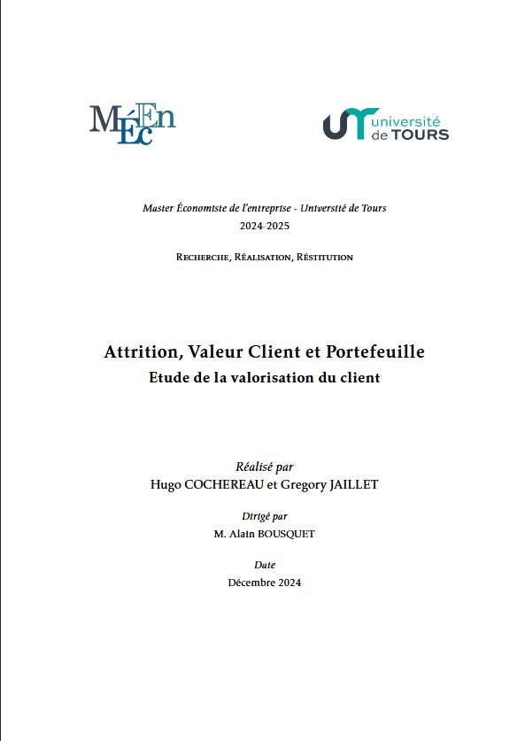
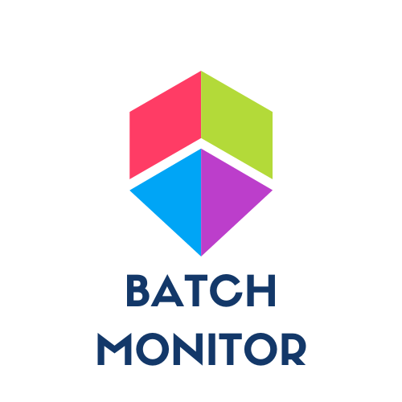

# Passionné de Data

##  Bonjour, et bienvenue sur mon site !

Je suis titulaire d'un master d'économie avec une spécialisation en Data Science. Tout au long de mon parcours, j'ai
développé des compétences en analyse statistique, économie industrielle, économétrie et machine learning que je suis
en mesure de mettre en oeuvre pour résoudre différents problèmes.

## Compétences

💻 Langages & Outils : Python | R | SQL | Git / GitHub

🔧 Data Engineering : ETL | Web Scraping | Data Pipelines | Dataiku

📊 Data Visualization : Tableau | Power BI | Streamlit | Plotly

🤖 Data Science : Machine Learning | Clustering | Feature Engineering | NLP | Analyse Factorielle | Statistiques | Économétrie

## Projets

<!-- Carte 1 -->

<a href="https://github.com/Greg-jllt/FightPredix" target="_blank" class="quarto-grid-link">

<h5 class="no-anchor card-title listing-title">FightPredix</h5>

Python

Machine Learning

Développement

Streamlit

Projet de Machine Learning visant à prédire le résultat d'une confrontation entre deux combattants UFC (64% Accuracy)

Hugo Cochereau & Gregory Jaillet

1 avr. 2025

</a>

<!-- Carte 2 -->

<a href="./sections/projets/3R/3R.html" class="quarto-grid-link">

<h5 class="no-anchor card-title listing-title">3R : Attrition, Valeur Client et Portefeuille</h5>

R

Python

Statistiques

Économétrie

Le rapport présente l’analyse la valeur vie client (Customer Lifetime Value – CLV) et les facteurs influençant la fidélisation dans le secteur des télécommunications.

Hugo Cochereau & Gregory Jaillet

1 avr. 2025

</a>

<!-- Carte 3 -->

<a href="./sections/projets/batchmonitor/batchmonitor.html" class="quarto-grid-link">

<h5 class="no-anchor card-title listing-title">
<i class="fa-solid fa-calculator" aria-label="chart-line"></i> Batch Monitor
</h5>

Python

Streamlit

BatchMonitor est une bibliothèque de programmation linéaire conçue avec python et le package Pulp pour résoudre des problèmes d’optimisation dans divers domaines tels que la logistique et la fabrication. Elle offre une API simplifiée. 

Hugo Cochereau & Gregory Jaillet

31 mai 2024

</a>

## Contact

<!-- FORMULAIRE -->

<form id="contact-form" class="contact-form">

<label for="fullname">Nom complet *</label>
<input type="text" id="fullname" name="fullname" required>

<label for="email">Email *</label>
<input type="email" id="email" name="email" required>

<label for="phone">Téléphone (optionnel)</label>
<input type="tel" id="phone" name="phone">

<label for="message">Message *</label>
<textarea id="message" name="message" rows="5" required></textarea>

<!-- reCAPTCHA centré avec marge -->

<button type="submit">Envoyer</button>
</form>

Merci ! Votre message a été envoyé avec succès.

<!-- CSS pour centrer le captcha et ajouter une marge -->

